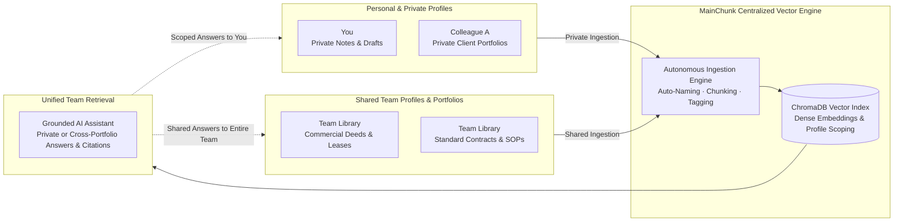
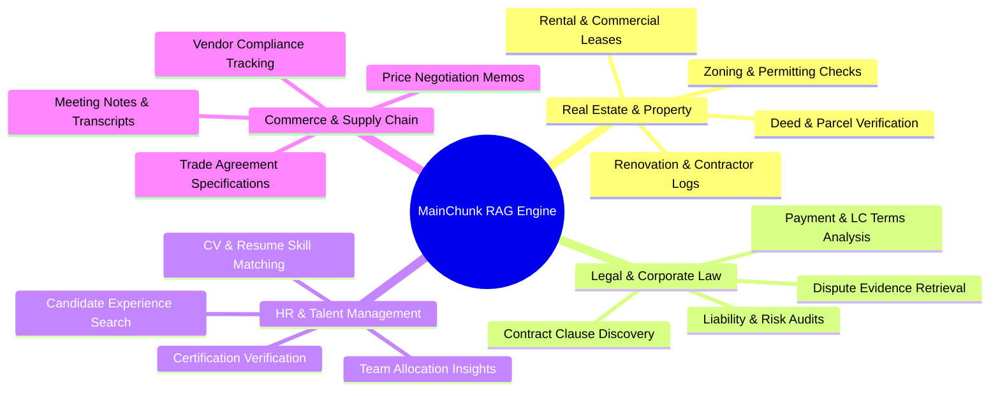

# MainChunk — Autonomous RAG Document Warehouse & Portfolio Intelligence System

**Transform chaotic documents, messy image scans, and unstructured notes into an autonomous, collaborative vector warehouse for you and your team with grounded AI conversational intelligence.**

---

## Application Demo Video

https://github.com/user-attachments/assets/acef8830-4b03-47d4-8982-b15625b8beed

---

## Overview: What is MainChunk?

**MainChunk** is an end-to-end, production-grade **Retrieval-Augmented Generation (RAG)** platform designed to solve document chaos and information silos experienced by modern teams and organizations.

Traditional storage solutions (like cloud drives or shared folders) are static and passive: files arrive with meaningless names (`IMG_9021.PNG`, `scan_1.pdf`), contents remain unindexed, and finding precise answers requires manual reading across hundreds of pages.

**MainChunk re-engineers this workflow with autonomous AI intelligence:**
1. **Autonomous Intake & Organization:** As PDFs, OCR image scans, or raw text memos are uploaded, GPT-4o vision and language models inspect the content, generate standardized semantic filenames (e.g., `1_Paris_Avenue_Montaigne_Title_Deed.pdf`), assign them to structured portfolio workspaces/folders, and extract metadata tags.
2. **Dense Vector Indexing:** Documents are cleaned, split into semantically coherent chunks, embedded via OpenAI `text-embedding-3-small`, and indexed in a local high-performance **ChromaDB** vector database.
3. **Grounded AI Assistant:** When users ask questions in natural language, MainChunk retrieves the most relevant semantic chunks and synthesizes accurate, hallucination-free answers backed by **clickable inline source citations**.
4. **Interactive Full-Screen Document Viewer:** Clicking any citation or document card immediately opens an edge-to-edge, full-screen document viewer with **instant Left/Right arrow key navigation** across all files in that portfolio.

---

## Shared Team Knowledge Warehouse & Multi-Portfolio Collaboration

MainChunk transforms fragmented files across individual members and teams into a **centralized, collaborative vector library with granular workspace isolation**. 

Whether you need a **private personal profile** for individual draft notes or a **collaborative shared team profile** for company-wide contracts, MainChunk acts as the unified intelligence layer for your organization:

### Key Collaboration & Profile Capabilities:
- **Personal Private Profiles vs. Shared Team Libraries:** Each member can maintain isolated private profiles for sensitive documents, individual draft notes, and confidential client folders, alongside shared team profiles accessible by the entire department.
- **Collaborative Multi-Portfolio Library:** You upload your property deeds and portfolios; your colleagues upload their supplier contracts, lease agreements, and meeting transcripts. MainChunk unifies shared assets into a single, structured digital warehouse.
- **Cross-Portfolio Global Search & AI Synthesis:** Query across your own personal records, specific team portfolios, or the entire shared company library simultaneously without needing to know who uploaded what or which folder it lives in (e.g., *"Compare penalty clauses across all commercial leases uploaded by the team"*).
- **Grounded Source Accountability:** When the AI answers any team inquiry, it provides verifiable clickable source pills linking directly to the specific page and document, ensuring total transparency and zero hallucinations.
- **Unified Note & Audio Transcription:** Voice memos, quick meeting notes, and OCR image scans uploaded by team members become immediately searchable across the vector space.

---

## Industry Use Cases

MainChunk's modular architecture makes it adaptable across diverse industries:

### 1. Real Estate & Property Management
- **Instant Deed & Parcel Verification:** Query parcel numbers, zoning status, and municipal terms directly from scanned deeds or cadastral plans.
- **Lease & Terms Retrieval:** Instantly cross-examine security deposits, monthly rent, indexation formulas, and termination clauses across dozens of active rental units.
- **Renovation Logs:** Search contractor engineering logs and architectural agreements for renovation progress, materials, and warranty dates.

### 2. Legal, Contracts & Compliance
- **Clause Discovery:** Find specific indemnification, force majeure, or non-compete clauses across multi-party contracts.
- **Financial & Letter of Credit (LC) Terms:** Identify payment schedules, bank guarantees, and commodity specifications in seconds.
- **Audit Trails:** Ensure every generated statement has an exact page and chunk citation for legal verification.

### 3. Human Resources & Talent Intelligence
- **Skillset & Stack Search:** Ask *"Which candidates have verified React and Python certifications?"* or *"Who has experience in building RAG systems?"*
- **Credential Verification:** Instantly pull up certificate images, diplomas, and accreditation credentials from candidate files.
- **Role Matching:** Match job requirements against internal resume repositories with high semantic precision.

### 4. Commerce, Trading & Procurement
- **Trade Agreement Specifications:** Retrieve chemical/mineral assay reports, packaging terms, and transport specifications.
- **Meeting Logs & Voice Transcripts:** Transcribe and index negotiation voice memos and client offer discussions for future reference.

---

## Retrieval-Augmented Generation (RAG) Architecture

> **Grounded AI Synthesis & Verifiable Citations:**
> MainChunk enforces strict zero-hallucination prompt engineering. Every synthesized sentence is backed by interactive clickable source pills (e.g., `1_Le_Marais_Furnished_Duplex_Lease.pdf (p.2)`). Clicking any citation opens the exact document in the full-screen viewer, accompanied by a collapsible **Source Documents** drawer with raw chunk text and similarity scores.

---

## Tech Stack

### Backend
| Technology | Role | Description |
| :--- | :--- | :--- |
| **Python 3.10+** | Core Language | Robust backend runtime |
| **FastAPI** | REST API Server | High-performance asynchronous API framework |
| **ChromaDB** | Vector Database | High-dimensional persistent dense vector index |
| **OpenAI API** | LLM & Embeddings | `gpt-4o-mini` for generation & `text-embedding-3-small` (1536-dim) for embeddings |
| **Whisper API** | Audio Transcription | Transcribes audio recordings into structured text notes |
| **Pydantic v2** | Data Validation | Strict data validation and schema definitions |
| **Tesseract / OCR** | Visual Extraction | OCR extraction for deed scans, photos, and images |

### Frontend
| Technology | Role | Description |
| :--- | :--- | :--- |
| **React 18** | UI Framework | Component-driven frontend architecture |
| **Vite** | Build Tool | Lightning-fast HMR and optimized production bundling |
| **Tailwind CSS** | Styling Engine | Modern, responsive utility-first UI design |
| **Lucide Icons** | Iconography | Clean, consistent iconography throughout the app |
| **KaTeX & Remark** | Markdown & Math | Formatted markdown with LaTeX equation rendering |

---

## Live Demo

> **Live Demo URL:** [https://ragsystem-production-6839.up.railway.app](https://ragsystem-production-6839.up.railway.app)
>
> MainChunk is live and running in a cloud container environment. Upload files to test autonomous categorization, search across portfolios, and experience grounded RAG conversational intelligence in real-time.

---

