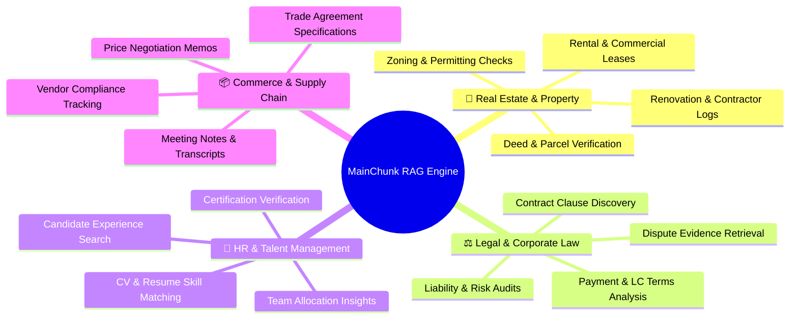
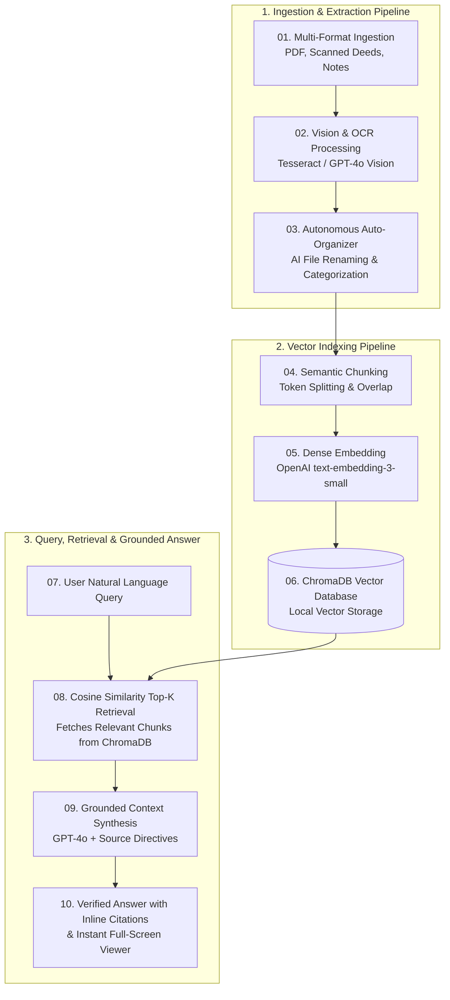

# ⚡ MainChunk — Autonomous RAG Document Warehouse & Portfolio Intelligence System

<div align="center">

[](https://www.python.org/)
[](https://fastapi.tiangolo.com/)
[](https://reactjs.org/)
[](https://vitejs.dev/)
[](https://tailwindcss.com/)
[](https://www.trychroma.com/)
[](https://openai.com/)

**Transform chaotic documents, messy image scans, and unstructured notes into an autonomous, self-organizing vector warehouse with grounded AI conversational intelligence.**

</div>

---

## 🎬 Application Demo Video

https://github.com/user-attachments/assets/b83ceabf-c4d3-4876-b9cf-ea255e2d6778

*(Demo video file located in: `For README/mainchunk_github_demo_16x9.mp4`)*

---

## 🌟 Overview: What is MainChunk?

**MainChunk** is an end-to-end, production-grade **Retrieval-Augmented Generation (RAG)** platform designed to solve the document chaos experienced by modern businesses.

Traditional storage solutions (like cloud drives or shared folders) are static and passive: files arrive with meaningless names (`IMG_9021.PNG`, `scan_1.pdf`), contents remain unindexed, and finding precise answers requires manual reading across hundreds of pages.

**MainChunk re-engineers this workflow with autonomous AI intelligence:**
1. **Autonomous Intake & Organization:** As PDFs, OCR image scans, or raw text memos are uploaded, GPT-4o vision and language models inspect the content, generate standardized semantic filenames (e.g., `1_Paris_Avenue_Montaigne_Title_Deed.pdf`), assign them to structured portfolio workspaces/folders, and extract metadata tags.
2. **Dense Vector Indexing:** Documents are cleaned, split into semantically coherent chunks, embedded via OpenAI `text-embedding-3-small`, and indexed in a local high-performance **ChromaDB** vector database.
3. **Grounded AI Assistant:** When users ask questions in natural language, MainChunk retrieves the most relevant semantic chunks and synthesizes accurate, hallucination-free answers backed by **clickable inline source citations**.
4. **Interactive Full-Screen Document Viewer:** Clicking any citation or document card immediately opens an edge-to-edge, full-screen document viewer with **instant Left/Right arrow key navigation** across all files in that portfolio.

---

## 🎯 Industry Use Cases

MainChunk's modular architecture makes it adaptable across diverse industries:



### 1. 🏢 Real Estate & Property Management
- **Instant Deed & Parcel Verification:** Query parcel numbers, zoning status, and municipal terms directly from scanned deeds or cadastral plans.
- **Lease & Terms Retrieval:** Instantly cross-examine security deposits, monthly rent, indexation formulas, and termination clauses across dozens of active rental units.
- **Renovation Logs:** Search contractor engineering logs and architectural agreements for renovation progress, materials, and warranty dates.

### 2. ⚖️ Legal, Contracts & Compliance
- **Clause Discovery:** Find specific indemnification, force majeure, or non-compete clauses across multi-party contracts.
- **Financial & Letter of Credit (LC) Terms:** Identify payment schedules, bank guarantees, and commodity specifications in seconds.
- **Audit Trails:** Ensure every generated statement has an exact page and chunk citation for legal verification.

### 3. 👥 Human Resources & Talent Intelligence
- **Skillset & Stack Search:** Ask *"Which candidates have verified React and Python certifications?"* or *"Who has experience in building RAG systems?"*
- **Credential Verification:** Instantly pull up certificate images, diplomas, and accreditation credentials from candidate files.
- **Role Matching:** Match job requirements against internal resume repositories with high semantic precision.

### 4. 📦 Commerce, Trading & Procurement
- **Trade Agreement Specifications:** Retrieve chemical/mineral assay reports, packaging terms, and transport specifications.
- **Meeting Logs & Voice Transcripts:** Transcribe and index negotiation voice memos and client offer discussions for future reference.

---

## 🧠 Retrieval-Augmented Generation (RAG) Architecture

<div align="center">


</div>

MainChunk implements a robust 3-step, 10-stage end-to-end RAG pipeline that bridges document extraction, vector geometry, and generative synthesis:



---

## 🏗️ Tech Stack

### Backend
| Technology | Role | Description |
| :--- | :--- | :--- |
| **Python 3.10+** | Core Language | Robust backend runtime |
| **FastAPI** | REST API Server | High-performance asynchronous API framework |
| **ChromaDB** | Vector Database | High-dimensional persistent dense vector index |
| **OpenAI API** | LLM & Embeddings | `gpt-4o-mini` for generation & `text-embedding-3-small` (1536-dim) for embeddings |
| **Whisper API** | Audio Transcription | Transcribes audio recordings into structured text notes |
| **Pydantic v2** | Data Validation | Strict data validation and schema definitions |
| **Tesseract / OCR** | Visual Extraction | OCR extraction for deed scans, photos, and images |

### Frontend
| Technology | Role | Description |
| :--- | :--- | :--- |
| **React 18** | UI Framework | Component-driven frontend architecture |
| **Vite** | Build Tool | Lightning-fast HMR and optimized production bundling |
| **Tailwind CSS** | Styling Engine | Modern, responsive utility-first UI design |
| **Lucide Icons** | Iconography | Clean, consistent iconography throughout the app |
| **KaTeX & Remark** | Markdown & Math | Formatted markdown with LaTeX equation rendering |

---

## ✨ Key Feature Highlights

### 📁 1. macOS Finder-Style Portfolio Explorer
- **Visual Folder Architecture:** Organize documents into custom client portfolios and sub-folders.
- **Navigation History:** Browser-style Back & Forward navigation (`Alt + Left/Right` shortcuts).
- **Drag & Drop:** Move files effortlessly between folders.
- **Batch Actions:** Multi-select files for batch deletion, folder relocation, or bulk download.

### 🔍 2. Instant Full-Screen Document Viewer with Keyboard Browsing
- Click any document or AI citation to instantly open an edge-to-edge full-screen viewer.
- **Keyboard Navigation:** Use **`←` Left Arrow** and **`→` Right Arrow** keys to cycle through documents in the folder.
- Support for **PDFs with embedded toolbars**, **high-res images with zoom controls**, and **editable text notes/memos**.

### 💬 3. Grounded AI Assistant with Exact Citations
- Strict zero-hallucination prompt engineering requiring exact source attribution.
- Citations are rendered as interactive pills (e.g. `📄 1_Le_Marais_Furnished_Duplex_Lease.pdf (p.2)`).
- Collapsible **Source Documents** drawer displaying exact chunk snippets and similarity metrics.

### 📊 4. Property & Asset Variety Analytics
- Real-time **Property & Portfolio Asset Breakdown** donut chart.
- Automatically classifies files into distinct real estate varieties:
  - 🏢 **Apartments & Residences**
  - 🏞️ **Land & Building Plots**
  - 🏡 **Villas & Mansions**
  - 🏬 **Commercial & Retail**
  - 🏗️ **Development & Projects**
  - 📜 **Legal Deeds & Contracts**

---

## 📁 Repository Structure

```
├── backend/
│   ├── app.py                     # FastAPI application entry point & CORS configuration
│   ├── config.py                  # Project paths, environment variables & allowed file types
│   ├── database.py                # ChromaDB vector store client & organizations JSON store
│   ├── models/
│   │   ├── chat.py                # Pydantic schemas for AI queries & responses
│   │   ├── documents.py           # Schemas for uploads, notes, batch operations
│   │   └── organizations.py       # Schemas for portfolios, folders, and tags
│   ├── routes/
│   │   ├── chat.py                # Grounded RAG conversational endpoint
│   │   ├── documents.py           # Ingestion, content retrieval, deletion, batch endpoints
│   │   ├── organizations.py       # Portfolio CRUD & document assignment endpoints
│   │   └── stats.py               # Document & vector telemetry endpoint
│   └── services/
│       ├── chat_service.py        # Dense similarity search & GPT-4o synthesis logic
│       ├── org_service.py         # Autonomous AI filename standardizer & auto-organizer
│       ├── text_service.py        # Semantic chunking & regex text normalization
│       ├── ocr_service.py         # Image & PDF OCR vision processing
│       └── whatsapp_service.py    # Audio transcription & mobile memo pipeline
│
├── frontend/
│   ├── src/
│   │   ├── components/
│   │   │   ├── Dashboard.jsx      # Analytics overview, asset donut chart & quick search
│   │   │   ├── Organizations.jsx  # macOS Finder-style portfolio explorer & full-screen viewer
│   │   │   ├── Upload.jsx         # AI Auto-Organize intake pipeline & Grounded AI Assistant
│   │   │   ├── Sidebar.jsx        # Navigation sidebar & active state management
│   │   │   └── Tour.jsx           # Interactive introductory platform walkthrough
│   │   ├── context/
│   │   │   └── LanguageContext.jsx# Application localization & dictionary definitions
│   │   ├── App.jsx                # Root view router & cross-view state coordinator
│   │   ├── main.jsx               # React DOM bootstrap
│   │   └── index.css              # Custom styling & scrollbar animations
│   ├── package.json               # Frontend dependencies & build scripts
│   └── vite.config.js             # Vite development proxy & bundler settings
│
├── uploads/                       # Persistent local storage for raw ingested files
├── db/                            # Persistent ChromaDB vector collections & organizations.json
├── For README/                    # Media & visual assets for GitHub documentation
│   ├── mainchunk_github_demo_16x9.mp4      # Full walkthrough demonstration video
│   └── RAG_Flow_Image_pscehgpscehgpsce.jpg # 10-stage end-to-end RAG architecture diagram
├── requirements.txt               # Backend Python dependencies
└── .env.example                   # Sample environment configuration template
```

---

## 🌐 Live Demo

> 🚀 **Live Demo URL:** `[Coming Soon / Live Link Deployment]`
>
> MainChunk is designed to run seamlessly in modern cloud container environments. Test queries, browse sample property portfolios, and experiment with grounded RAG retrieval in real-time.

---


